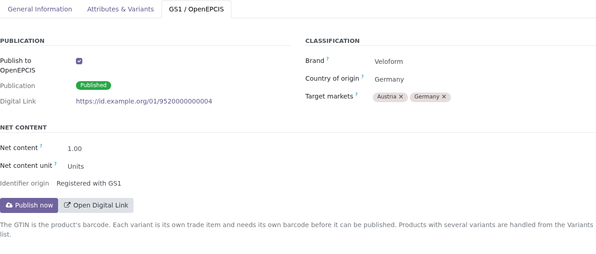
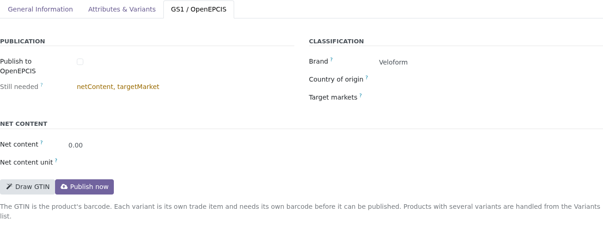
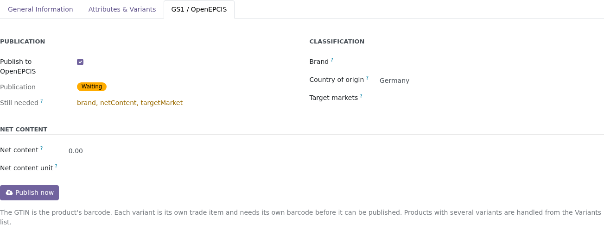
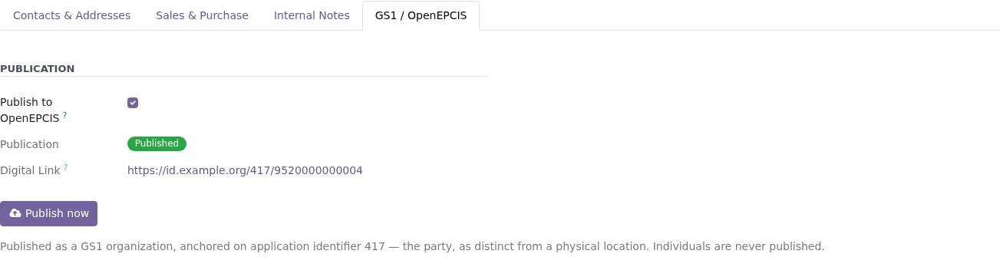
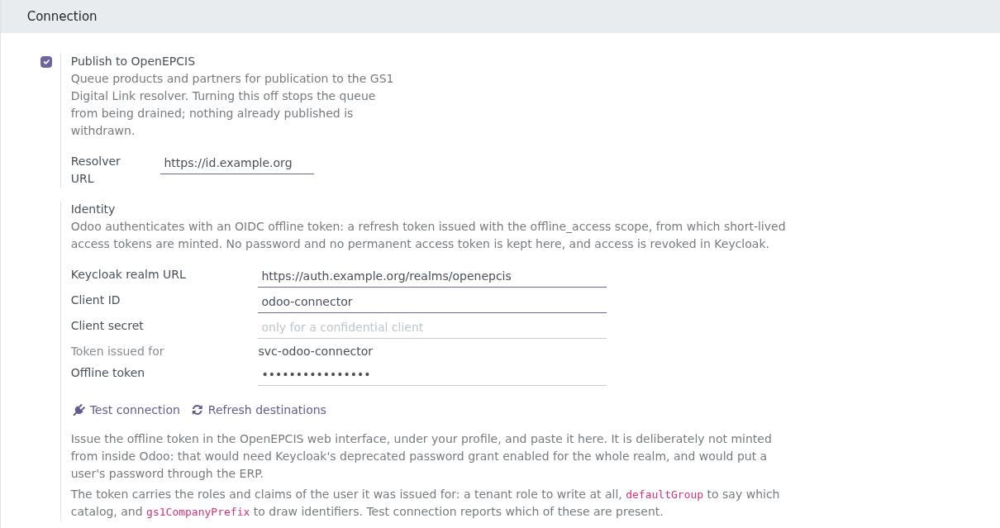
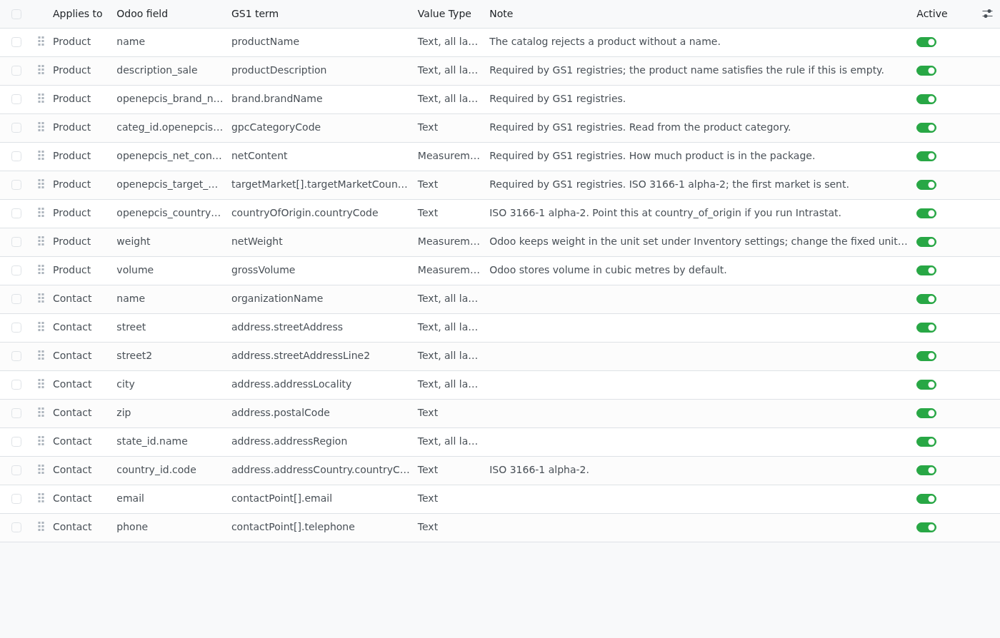
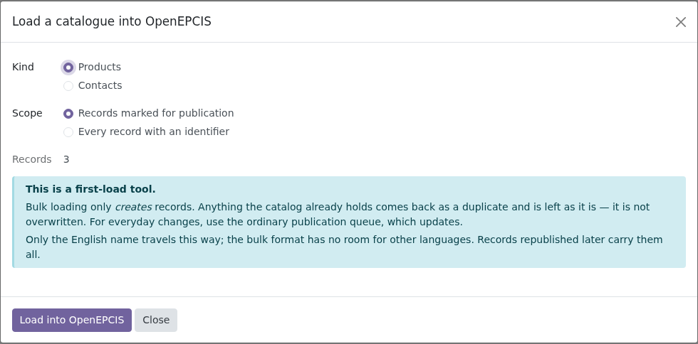

# OpenEPCIS Connector for Odoo

Publishes Odoo master data to an [OpenEPCIS](https://openepcis.io) catalog behind
a GS1-conformant Digital Link resolver, and brings the resulting Digital Link and
QR code back onto the Odoo form.

The data a Digital Product Passport is built from — product name, brand, weight,
country of origin, manufacturer — is already in the ERP. This addon stops it from
being typed a second time.



| | |
|---|---|
| **Licence** | LGPL-3 |
| **Odoo** | 18.0 (branch `18.0`), 19.0 (branch `19.0`) |
| **Dependencies** | `product` only. No Python packages beyond what Odoo ships. |
| **Direction** | Odoo → OpenEPCIS. See [Limits](#limits). |
| **Auth** | OIDC offline token — no static key, no stored password |

---

## What it does

- **Products and contacts are queued on save** and published in the background by
  a scheduled action. Saving a product never waits for the network.
- **Publishing is opt-in.** Nothing leaves the database until someone ticks
  *Publish to OpenEPCIS* on a record or runs the mass action.
- **The field mapping is data, not code.** Which Odoo field feeds which GS1 term
  is a list of records an administrator can edit — because no two Odoo databases
  keep a brand in the same place.
- **Identifiers can be drawn from your own GS1 company prefix**, so a product
  without a barcode is one button away from having a real GTIN.
- **It says what a registry still wants** before you publish, instead of after a
  refusal.
- **The Digital Link and its QR code** appear on the product form and on a
  printable label.

Publication onward to a GS1 national registry happens on the OpenEPCIS side. The
connector writes to the catalog; the platform forwards. It never talks to GS1
directly.

---

## Getting a product published

**1. Give the product a barcode.** It is the GTIN. Each variant is its own trade
item and needs its own.

No barcode? **Draw GTIN** takes the next free number from your company prefix. The
number is *held* — it is registered with GS1 only when the product is saved,
because registration cannot be undone. Until then you can hand it back.



**2. Set the GPC brick on the product category** — once per category, not per
product. Every product in the category inherits it, and the picker searches GS1's
classification by name so nobody has to know eight digits by heart.

**3. Fill in what a registry requires.** The form lists what is still missing and
keeps the list current as you type. This comes from the destination itself: the
platform reports which terms it insists on, so the list is not a guess baked into
this addon.



It informs, it does not block. A passport is filled in over time and by several
people, so an unmet requirement must never hold data hostage — an incomplete
record is published and completed later.

**4. Tick *Publish to OpenEPCIS* and save.** Within five minutes the state turns to
*Published* and the Digital Link appears. **Publish now** does it immediately and
reports the outcome.

Company contacts work the same way, published as GS1 organizations:



Note the `417`: that is the party, as distinct from `414`, a physical location.
Both are GLNs; the resolver routes them separately.

---

## Lots and serial numbers

A GTIN names the *model* of a thing. The batch it came from and the single unit
in front of you are one level down, and GS1 keeps that level in the Digital Link
path: `/01/<gtin>` is the model, `/01/<gtin>/10/<lot>` the batch,
`/01/<gtin>/21/<serial>` the unit. The catalog stores a distinct document at
each level.

The bridge addon **`openepcis_connector_stock`** publishes Odoo's lots and
serial numbers (`stock.lot`) to those instance paths. It installs itself
automatically wherever this connector and the Inventory app are both present —
the main addon stays dependent on `product` only. Whether a record becomes a
batch or a serial follows the product's tracking setting, and the instance-level
Digital Link with its QR code appears on the lot form, where a warehouse
actually prints labels.

One rule of order: **the product goes first.** An instance document hangs off
the product's GTIN, so a lot whose product is not published yet is not an
error — it waits, says so on its form, and follows on its own the moment the
product lands in the catalog.

Instance fields are ordinary mapping rows. A second, data-only bridge,
**`openepcis_connector_product_expiry`**, maps the expiry dates that the
`product_expiry` module keeps on lots — expiration date, best-before date — so a
database without that module never carries mapping rows pointing at fields it
does not have.

---

## Installation

```bash
git clone https://github.com/openepcis/openepcis-odoo.git
# put openepcis_connector on your addons path, then:
odoo -d yourdb -i openepcis_connector
```

Then **Settings → General Settings → OpenEPCIS**.



---

## Authentication: an offline token

Odoo stores an **OIDC offline token** — a refresh token issued with the
`offline_access` scope — and mints a short-lived access token from it for every
call. Nothing long-lived goes over the wire, no password is kept, and access is
withdrawn in Keycloak by removing the offline session, without touching Odoo.

**This addon consumes a token; it never mints one.** Issue it in the OpenEPCIS web
interface, under your profile, and paste it into the *Offline token* field.

That split is deliberate. Minting a token here would need Keycloak's
*Direct Access Grants* — the password grant, removed in OAuth 2.1 — enabled for the
whole realm, and would route a user's password through the ERP. Issuing belongs
where a human is present in a browser and can consent.

You configure **one URL** — the resolver's. The connector reads the resolver's
OAuth 2.0 Protected Resource Metadata (RFC 9728,
`/.well-known/oauth-protected-resource`) to find which Keycloak realm issues its
tokens, then discovers that realm's endpoints from there. The *Keycloak realm
URL* field stays as an optional override, for a resolver that does not publish
the metadata.

The addon checks what it can when you paste a token: an ordinary refresh token is
refused on the spot, because it would work for a few minutes and then stop, long
after you had moved on. It also stores a rotated refresh token if your realm has
*Revoke Refresh Token* switched on — losing that would lock the connector out with
a credential that still looks correct on screen.

### What the token's user needs

The token carries the roles and claims of the user it was issued for, so that
user — not you — is what the resolver sees. It must have:

| What | Why | Symptom when missing |
|---|---|---|
| Realm role named after your tenant (or `<tenant>/create`, `<tenant>/update`) | Authorises writes | `403` on every publish |
| Claim `defaultGroup` | Names the tenant whose catalog is written | `400 … carries no defaultGroup claim` |
| Claim `gs1CompanyPrefix` | Bounds which GTINs and GLNs you may write | `403` on keys outside your prefix |

Optional, and only if you publish product images: the realm role `files-writer`.

**Test connection** probes the token first and then each of these in turn, naming
whichever is missing — so you do not have to read resolver logs to find out. It
also tells "this deployment is older than the feature" apart from "your token is
short a claim", which look identical from the outside.

On the client itself: allow the `offline_access` scope, or Keycloak issues an
ordinary refresh token and the connector stops working when the session ends.

**A token is bound to the issuer URL it was minted under.** Where an alias and a
canonical hostname both serve one realm, a token issued via one and refreshed via
the other fails — the addon reports that case specifically rather than calling it
revoked, because the fix is entirely different.

`doc/keycloak.md` records the client settings, the required claims, and what was
measured against Keycloak 26.2.5 — including why RFC 8693 token exchange cannot
mint an offline token and what to use instead. `doc/keycloak-test-realm.json`
reproduces it locally in one command.

---

## The field mapping

**Settings → Technical → OpenEPCIS → Field mapping.**

Each row says which Odoo field feeds which term of the published document. Dotted
paths work on both sides: `categ_id.openepcis_gpc_code` reads across a relation,
`brand.brandName` writes into a nested object, and a `[]` segment builds a list.



The shipped rows are starting points, marked `noupdate` so an upgrade will not undo
your edits. Two worth knowing about:

- **Country of origin** points at a field this addon adds, not at Odoo's
  `country_of_origin` — that one comes from the Intrastat module, which is
  Enterprise. If you run it, repoint the row and delete the spare field.
- **Weight** is sent as `KGM`. If your database is configured in pounds, change the
  fixed unit on that row to `LBR`.

---

## Loading an existing catalogue

**Settings → Technical → OpenEPCIS → First load.**

Publishing ten thousand products one HTTP call at a time takes an afternoon. The
wizard sends them as a single CSV upload instead, in chunks.



It is a first-load tool and nothing more: the endpoint behind it **creates** records
and does not update them, so anything the catalog already holds comes back as a
duplicate and is left alone. It also carries only the English name — the bulk format
has one column per term and no way to express a language map. Everything published
later through the ordinary queue carries every language and every mapped field.

---

## Limits

**One direction.** Changes made in the OpenEPCIS web interface do not come back to
Odoo. The platform's master-data events do not leave the resolver process — there is
no webhook to subscribe to — so a return channel would need work on the platform
side, not here.

**`PUT` merges, it does not replace.** Clearing a field in Odoo leaves the published
value in place, because an absent key means "leave alone" to the catalog. Removing a
published value is a deliberate act and this addon does not do it as a side effect
of a sync.

**Places and EPCIS events are out of scope.** Warehouses as GS1 places, and stock
moves as EPCIS events, are separate undertakings.

**Some features need a recent resolver.** Drawing identifiers, the GPC picker and
the readiness list rely on endpoints that older deployments do not have. Test
connection reports that as "not available on this deployment" rather than as a fault
on your side.

---

## ⚠️ Drawing identifiers is not a dry run

**There is no GS1 sandbox.** The platform's GS1 credentials are production
credentials, and a registered identifier is registered for good — GS1 will neither
delete nor deactivate a key that has no product data behind it.

The connector is built around that fact: **Draw GTIN** only *holds* a number
locally, and it is registered upstream at the moment the record is saved. A number
you drew and then abandoned can be handed back; a number that has been confirmed
cannot.

Before testing against anything other than a development deployment, check with your
platform operator that `OPENEPCIS_GS1DE_DRY_RUN` is `true`. And use the **952**
prefix for anything experimental — GS1 reserves it for exactly this.

---

## Development

```bash
# A local Odoo with the addon mounted, on http://localhost:8069
docker compose up -d

# The test suite
docker compose run --rm odoo odoo -d test \
  -i openepcis_connector,openepcis_connector_stock,openepcis_connector_product_expiry \
  --test-enable \
  --test-tags /openepcis_connector,/openepcis_connector_stock,/openepcis_connector_product_expiry \
  --stop-after-init

# Lint and formatting, as CI runs them
ruff check . && ruff format --check .

# Does this branch agree with itself about which Odoo release it targets?
python tools/check-release-idioms.py
```

Odoo exits 0 even when tests fail, so the summary line in the log is the source of
truth — `0 failed, 0 error(s)`. CI checks that line rather than the exit code.

The tests never touch a real resolver. They stub the HTTP client, because a suite
that talked to a live platform would depend on a network, on credentials, and —
since a confirmed identifier is registered with GS1 for good — on nothing ever going
wrong. The live check is the manual smoke test above, against a development
deployment, with 952-prefix identifiers.

`utils/gs1.py` is written against the GS1 General Specifications — section 7.9 for
the check digit, the key-format tables for permitted lengths — and against nothing
else. It shares no code with any server-side component, which is what lets this
addon carry its own licence without qualification. Its tests verify the arithmetic
against the property the specification states rather than against the module's own
output, and they need no database, which is why CI runs them first.

Keys are validated in the addon **and** again by the resolver. That is deliberate:
catching a mistyped GTIN while the person who typed it is still looking at it is
worth a little duplication, and the resolver remains the authority.

The ruff version is pinned in `pyproject.toml`. A formatter is only useful if
everyone runs the same one — ruff's output changes between releases, so an unpinned
setup turns CI red on an unrelated push and reformats files nobody touched. A
mismatched version says so rather than quietly rewriting your diff:

```
Required version `0.16.2` does not match the running version `0.2.2`
```

Install the pinned one with `pipx install ruff==0.16.2`, or in a virtualenv.

### Branches

`18.0` and `19.0`, following Odoo's convention: one branch per supported release,
with the same code and only the version-specific differences between them. Business
logic is deliberately version-neutral Python and the views avoid custom
JavaScript — the GPC picker is a wizard rather than an autocomplete widget for
exactly this reason — so a port stays cheap.

In practice the two differ in exactly four places in the code, and it is worth knowing
which, because only one direction of the mistake fails loudly.

**Table constraints.** The `18.0` branch uses `_sql_constraints`; Odoo 19 declares them
as `models.Constraint`, which does not exist in 18. Carrying the old form to 19 is the
dangerous direction: 19 accepts it, warns about it once, and then **ignores** it, leaving
a uniqueness rule uncreated — two contacts sharing one GLN, the same movement twice in
the outbox — with nothing but a startup warning to say so. The other direction is
harmless: 18 does not know `models.Constraint` and says so at once.

Because only one of the two directions fails loudly, CI checks it rather than trusting
a reviewer to notice. `tools/check-release-idioms.py` reads the target release from the
addon manifests and refuses the old form on 19 and the new one on 18. It checks two more
things a port gets wrong quietly: manifests that disagree with each other about the
release, and a container tag still pointing at the other one.

And every pull request is carried onto the other branch before it is merged. A
`port-check` job merges the change into the counterpart, runs the same idiom check there
and then the full suite on that release's Odoo. A red port check does not mean the change
is wrong — it means the other branch needs its own version of it, which is much cheaper
to write while the change is still in front of you. It is advisory until 2026-09-15 and
blocking after that.

Which branch the counterpart is, is not written in the workflow: CI asks
`tools/check-release-idioms.py --other`, which derives it from the manifests. A workflow
that named the other release would itself be one more difference between the branches.

Changes land on `18.0` and reach `19.0` by **merging**, not by applying the same commit
to both. A commit cherry-picked onto each branch adds the same file twice with no shared
ancestor, and every later merge of that file then conflicts for good. This paragraph
exists because that was learned the expensive way, one afternoon, on the very tooling
meant to keep the branches together.

**The package model.** Odoo 19 renamed `stock.quant.package` to `stock.package` and let
units nest inside one another. **The produced lot** on a manufacturing order became a
Many2many, `lot_producing_ids`. And **a search group** on 19 takes neither `expand` nor
`string`.

Installing the wrong branch cannot happen quietly either. Odoo 18 refuses a manifest
version of `19.0.x` outright, before it loads any Python.

The units of measure look like a further difference and are not: Odoo 19 renamed some
records (`product_uom_mm` became `product_uom_millimeter`) and added others
(`product_uom_milliliter`). Both spellings are listed in one table and a name the
running release does not have is skipped, so the same file serves both.

### About the screenshots

Odoo 18 with demo data. Hostnames are `example.org` placeholders, the published
states were seeded locally, so nothing shown was ever registered anywhere, and
every identifier is in the reserved 952 test range — check digits included, which
were verified against the platform's own validator rather than this addon's.
